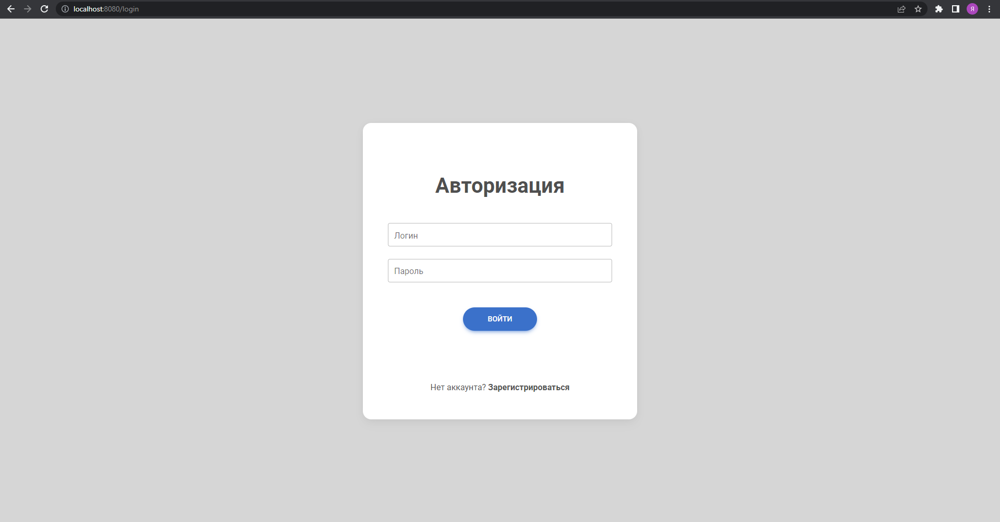
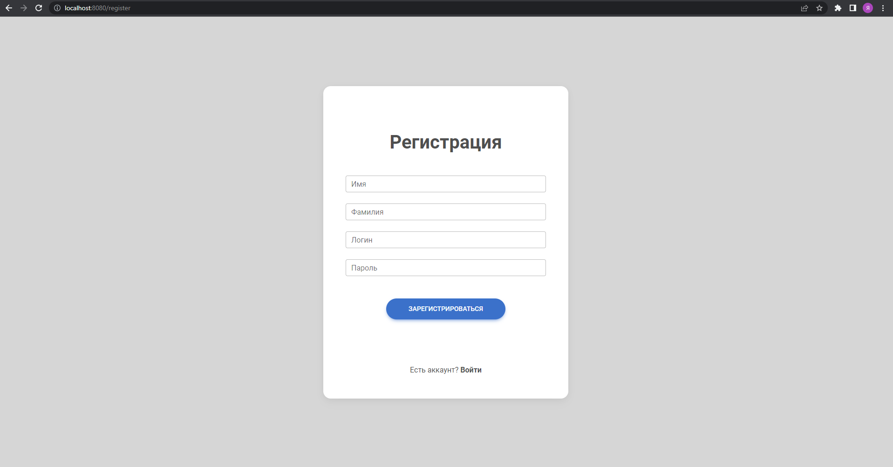
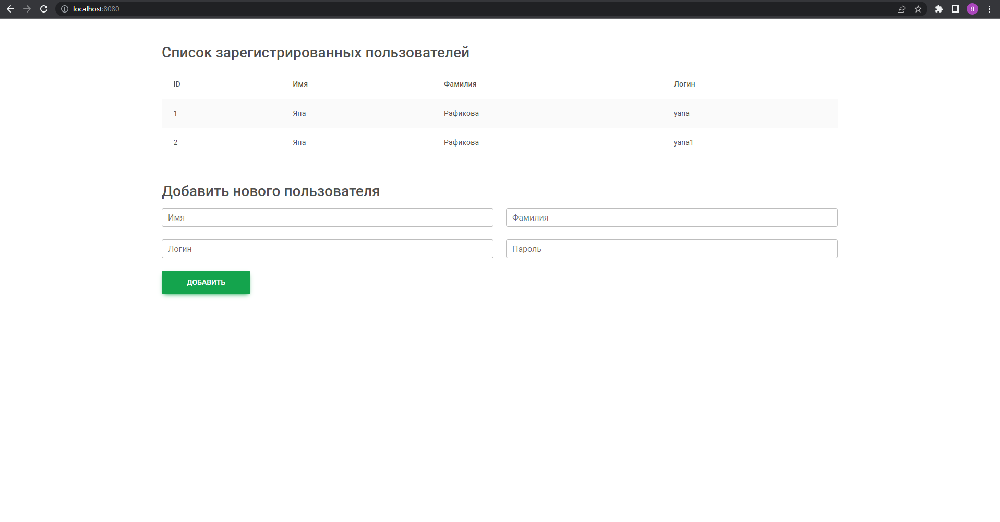
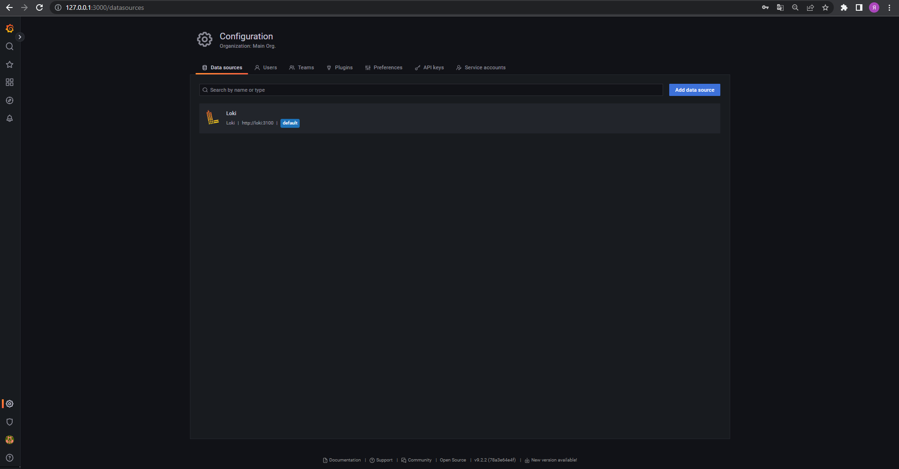
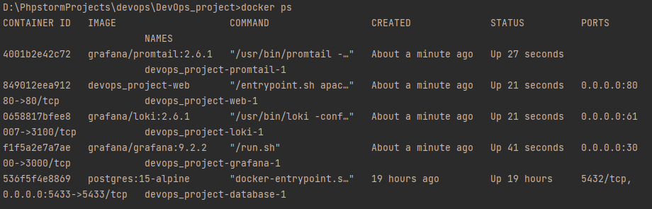
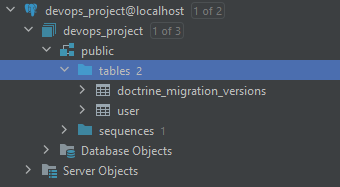

# DevOps - итоговая работа

## Описание приложения

### Характеристики
Проект представляет собой веб-приложение на PHP (7.4) с использованием фреймворка Symfony (5.4) и СУБД PostgreSQL. Развёртывание приложения осуществляется с помощью Docker. Логирование обеспечивается с помощью Loki. Просмотр логов осуществляется через Grafana.

### Функционал
- Авторизация (http://localhost:8080/login)
  
  
- Регистрация (http://localhost:8080/register)

  
- Добавление новых пользователей и вывод всех пользователей (http://localhost:8080/)
  
  

### Просмотр логов
Просмотр логов с использованием Loki осуществляется через Grafana (http://127.0.0.1:3000/)



## Запуск приложения
```docker-compose up -d```



В результате выполнения сборки контейнера будут доступны:

- Сервер PostgreSQL с примененными миграциями

  
- Сервер Apache
- Grafana
- Loki
- Promtail

Все конфигурационные файлы и entrypoint находятся в папке ```docker```
